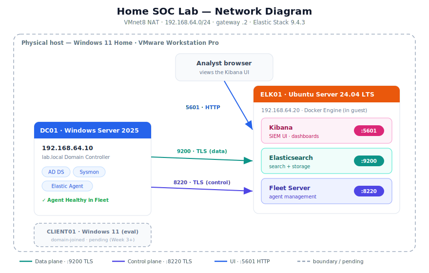
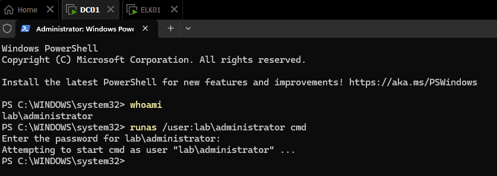
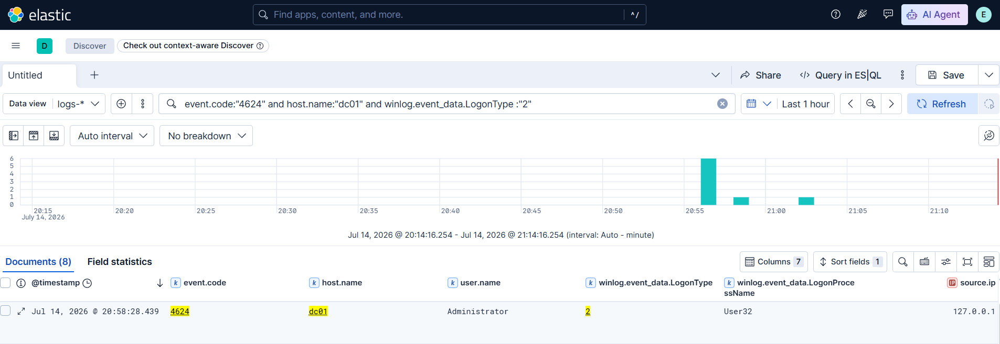
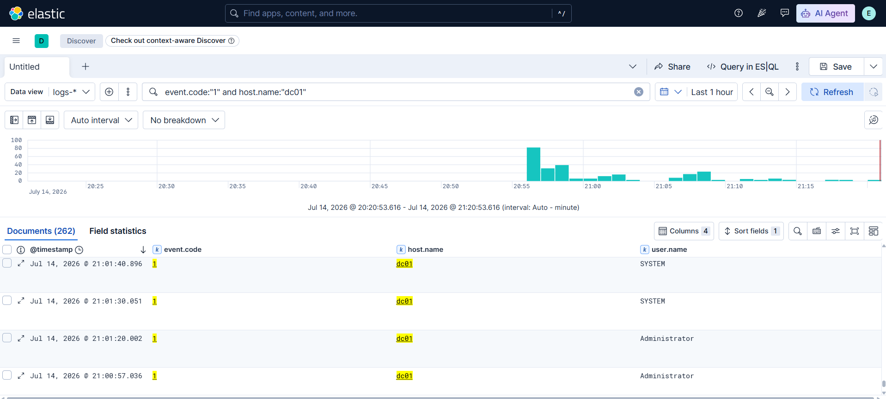
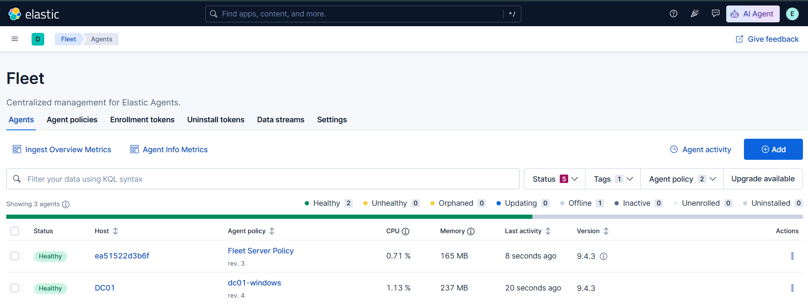

# Project 1 - Attack & Defend: A Home SOC with a Public Detection Portfolio

A small, enterprise-shaped lab where I stand up realistic telemetry, attack the
environment with real adversary tradecraft, and then **detect, triage, and document**
each attack the way a SOC analyst would. This repo is the running record: the build,
the detections, and the incident reports.

It now covers the **lab foundation** (a Windows Active Directory domain and an Elastic
SIEM), a **domain-joined Windows client** wired into the same telemetry pipeline, and the
**first detection**: an attacker technique run against the client, hunted in the SIEM,
tuned into a resilient rule, and written up as a one-page incident report.

---

## What this demonstrates

- Building enterprise-style infrastructure from scratch: a promoted **Active Directory
  domain controller**, a domain-joined **Windows 11 client**, and a single-node
  **Elastic Stack** SIEM.
- Understanding **what a SOC actually sees**: Windows Security event IDs and Sysmon
  process telemetry, normalised into Elastic Common Schema (ECS).
- Standing up a modern log pipeline with **Fleet-managed Elastic Agent** over TLS,
  including the certificate, encryption-key, and output-trust details that make it work.
- **Detection engineering, not just detection:** running an attack, hunting the telemetry
  it produced, finding where a naive rule *fails*, and tuning it so evasion doesn't slip
  through, then documenting the whole loop as an incident report.
- The discipline that matters day one: **no secrets in the repo**, reproducible builds,
  and evidence-backed documentation.

---

## Architecture at a glance



Three VMs on a single 16 GB laptop, connected over VMware's **VMnet8 NAT** network
(`192.168.64.0/24`, gateway `.2`).

| Host | OS | IP | Role | Status |
|---|---|---|---|---|
| **DC01** | Windows Server 2025 (Desktop Experience) | `192.168.64.10` | `lab.local` Domain Controller (AD DS + DNS); Sysmon; Elastic Agent | Built, promoted, shipping |
| **ELK01** | Ubuntu Server 24.04 LTS | `192.168.64.20` | Elasticsearch + Kibana + Fleet Server (Docker); later, the Linux attack target | Built, verified, healthy |
| **CLIENT01** | Windows 11 Enterprise (eval) | `192.168.64.30` | Domain-joined client and **attack target**; Sysmon; Elastic Agent | Built, instrumented, shipping |

> The lab runs on **VMware Workstation Pro** rather than Hyper-V (the host is Windows 11
> **Home**), which also gives clean **snapshots**, I snapshot a known-good baseline before
> every attack and roll back afterward. Elastic runs in **Docker inside the Ubuntu guest**,
> not Docker Desktop on the host, so the Windows VMs keep VMware's native hypervisor.
>
> **RAM discipline (16 GB):** idle VMs stay powered off. All three run together only during
> an active attack-and-detect cycle; the Elasticsearch JVM heap is capped (~1.5 GB, ample
> for lab volume).

---

## Software versions

| Component | Version |
|---|---|
| Hypervisor | VMware Workstation Pro (personal use) |
| Domain Controller | Windows Server 2025 (eval) |
| Windows client | Windows 11 Enterprise (eval) |
| SIEM host | Ubuntu Server 24.04 LTS |
| Elastic Stack (Elasticsearch, Kibana) | **9.4.3** (pinned) |
| Fleet Server / Elastic Agent | **9.4.3** |
| Endpoint telemetry | Sysmon + SwiftOnSecurity config |
| Attack simulation | Atomic Red Team |

---

## How telemetry flows (endpoint → Fleet → Elasticsearch → Kibana)

Each Windows endpoint runs an Elastic Agent that uses two separate TLS connections to ELK01:

- **Control plane: Fleet Server on `:8220` (TLS).** The agent enrolls against Fleet,
  receives its policy, and reports health.
- **Data plane: Elasticsearch on `:9200` (TLS).** The agent ships collected events
  directly into Elasticsearch, into `logs-*` data streams.

Both endpoints carry the same two integrations, on their own policies (`dc01-windows`,
`client01-windows`):

- **System** → Windows Security channel, including logon events such as **`4624`**,
  account creation **`4720`**, and scheduled-task creation **`4698`**.
- **Windows** → the `sysmon_operational` channel, including Sysmon **EID 1** (process create).

Analysis happens in the browser against **Kibana on `:5601`** (plain HTTP is fine on the
private NAT). X-Pack security + TLS are enabled throughout — not decoration, but a hard
requirement for Fleet to function.

---

## First detection: T1059.001 PowerShell encoded command

Week 3 closes the full loop: **attack → log → detect → tune → document**. I ran an
Atomic Red Team test for **T1059.001 (Command and Scripting Interpreter: PowerShell)**
against CLIENT01: PowerShell launched with an *encoded command* switch, the classic
obfuscation trick that hides what actually ran inside a Base64 blob.

**The detection, and the gap it exposed.** My first hunt filtered the command line on the
literal string `Encode` and missed the real event. The atomic launched PowerShell using
the single-letter alias **`-E`** (a valid abbreviation of `-EncodedCommand`), which never
contains the string "Encode." A rule written against the full switch name is blind to it.
Broadening the hunt revealed the true event: `powershell.exe -NoProfile -E <base64>`,
spawned by **`WmiPrvSE.exe`** (i.e. via WMI).


Decoding the Base64 (PowerShell uses UTF-16LE) resolved it to a benign marker the atomic
writes to prove execution confirming this as controlled test activity:


**The fix.** The Sigma rule was rewritten from a literal string match to an **alias-aware
regex** that matches `-e` followed by any valid prefix of `ncodedcommand` (`-e`, `-en`,
`-enc`, `-ec` … `-EncodedCommand`, case-insensitive), plus a **behavioural backstop** that
flags PowerShell whose parent is `WmiPrvSE.exe` regardless of how the switch is spelled.
That tuning, closing an evasion gap I found by attacking my own lab, is the point of the
exercise, and exactly the reasoning a SOC role probes for.

- **Detection rule:** [`detections/T1059.001-powershell-encoded-command.yml`](./detections/T1059.001-powershell-encoded-command.yml)
- **Incident report:** [`incident-reports/T1059.001-powershell-encoded-command.md`](./incident-reports/T1059.001-powershell-encoded-command.md)

---

## Reproduce it yourself

The full, step-by-step build lives in `docs/`:

1. **[`docs/01-lab-build-elk01.md`](./docs/01-lab-build-elk01.md)** - build ELK01: Ubuntu
   VM → Docker Engine → single-node Elastic Stack 9.4.3 (security + TLS, heap-capped) →
   verify Kibana loads.
2. **[`docs/02-sysmon-dc01.md`](./docs/02-sysmon-dc01.md)** - install Sysmon on DC01 with
   the SwiftOnSecurity config and confirm EID 1 in `Microsoft-Windows-Sysmon/Operational`.
3. **[`docs/03-fleet-dc01.md`](./docs/03-fleet-dc01.md)** - add Fleet Server to the compose
   stack and enroll the Elastic Agent on DC01. Includes an interview-ready **"Gotchas"**
   section (cert SANs for the ELK IP, absolute cert paths, Kibana encryption keys, and
   making the Fleet default output trust the lab CA).
4. **[`docs/04-client01-build.md`](./docs/04-client01-build.md)** - build and domain-join
   CLIENT01, install Sysmon, enroll the Elastic Agent, and verify its telemetry
   (`4624` + Sysmon EID 1 for `host.name:"client01"`). Includes a **"Gotchas"** section
   (clock-skew → Kerberos, DNS fail-over with the DC off, large agent-zip download,
   headless-ELK01 CA transfer via `scp`).

The Docker starter kit is in **[`elk/`](./elk/)**: `docker-compose.yml`, `.env.example`,
`bring-up.sh`, and `verify.sh`. Copy `.env.example` to `.env`, fill in your own values,
then bring the stack up.

**Prerequisites:** a host with hardware virtualisation enabled, ~16 GB RAM (practical
floor, keep idle VMs powered off), and ~80 GB free disk (use thin-provisioned disks).

> For live endpoint telemetry, ELK01 plus the endpoint you're working with must be running
> together. For an attack-and-detect cycle, that's **CLIENT01 + ELK01**; DC01 only needs to
> be up when a technique touches the domain.

---

## Verifying the pipeline: from action to searchable event

The lab-foundation milestone was proving I can see my own activity as SOC telemetry. I
traced a single action end to end, from the command that caused it to the event in the SIEM.

**1. Generate a logon on DC01.** From an elevated PowerShell I confirmed my identity and
forced a fresh interactive logon:



`runas /user:lab\administrator cmd` triggers a Windows Security **event 4624** (an account
was successfully logged on), **Logon Type 2** (interactive).

**2. Find it in Kibana.** Seconds later the event is in Discover (`logs-*`):

```
event.code : "4624" and host.name : "dc01" and winlog.event_data.LogonType : "2"
```



The event at **20:58:28** matches the `runas` above: account `Administrator`,
`LogonType 2` (interactive), `LogonProcessName User32`, `source.ip 127.0.0.1` (a local
logon). That timestamp-and-attribute match is the whole point of the milestone, my action
on DC01 became a queryable event in the SIEM within seconds.

**3. Sysmon telemetry in parallel.** The Windows integration also ships Sysmon, so the same
host produces process-level telemetry. Here are Sysmon **EID 1** (process create) events
from DC01:

```
event.code : "1" and host.name : "dc01"
```



**Pipeline health.** Both the Fleet Server agent and the DC01 agent (policy `dc01-windows`)
report **Healthy** in Fleet, on Stack 9.4.3:



Together this confirms endpoint (Sysmon EID 1) **and** security (Windows 4624) telemetry
flowing over a healthy, Fleet-managed, TLS pipeline, I can see the lab. CLIENT01 was later
brought onto the same pipeline (`client01-windows`) and verified the same way, which is what
made the first detection above possible.

---

## Secrets & safety

No credentials or secrets are committed. The repo `.gitignore` excludes `.env`, the
generated Fleet **service token**, the Kibana **encryption keys**, and all **TLS certs**
and stack data. Passwords (Administrator, DSRM, `elastic` / `kibana_system`) are recorded
**outside** this repo. `.env.example` documents the required variables with placeholder
values only.

---

## Repo layout

```
project-1-home-soc/
├── README.md                     # this file
├── docs/
│   ├── 01-lab-build-elk01.md     # ELK01 build walkthrough
│   ├── 02-sysmon-dc01.md         # Sysmon install + verification
│   ├── 03-fleet-dc01.md          # Fleet Server + DC01 agent enrollment (+ Gotchas)
│   ├── 04-client01-build.md      # CLIENT01 build, domain-join, instrument (+ Gotchas)
│   ├── network-diagram.svg       # lab network diagram
│   └── img/
│       ├── cmd-runas-dc01.png                    # the action: runas on DC01
│       ├── 4624-kibana-discover.png              # the result: 4624 logon in Kibana
│       ├── 1-kibana-discover-sysmon.png          # Sysmon EID 1 in Kibana
│       ├── healthy-fleet-dc01-elk01.png          # DC01 agent Healthy in Fleet
│       ├── healthy-fleet-client01-elk01.png      # CLIENT01 agent Healthy in Fleet
│       ├── 4624-kibana-discover-Client01.png     # CLIENT01 4624 (cached logon)
│       ├── Sysmon-EID1-Client01.jpg              # CLIENT01 Sysmon EID 1
│       ├── cmd-runas&ping-client01.png           # CLIENT01 verification marker
│       ├── T1059.001-discover-child-process.png  # detected encoded PowerShell (WMI parent)
│       └── T1059.001-decoded-payload.png         # decoded benign marker
├── elk/
│   ├── docker-compose.yml        # Elasticsearch + Kibana + Fleet Server
│   ├── .env.example              # required variables (no secrets)
│   ├── bring-up.sh
│   └── verify.sh
├── detections/                   # one Sigma rule per technique
│   └── T1059.001-powershell-encoded-command.yml
└── incident-reports/             # one-page reports per attack
    └── T1059.001-powershell-encoded-command.md
```

---

## Status & roadmap

**Weeks 1–2: Stand up the lab and prove you can see.** ✅ Complete.

- [x] VMware Workstation Pro installed; virtualisation confirmed
- [x] DC01 built, promoted to `lab.local` (`Get-ADDomain` verified)
- [x] ELK01 built; Elastic Stack 9.4.3 deployed (security + TLS, heap-capped)
- [x] Sysmon installed on DC01 (SwiftOnSecurity config); EID 1 verified
- [x] Fleet Server stood up; Elastic Agent enrolled on DC01 (Healthy)
- [x] Own `4624` logon traced from `runas` to Kibana; README, diagram, and screenshots committed

**Week 3: CLIENT01 as a target, and first detections.** 🔄 In progress (1 of 3 detections done).

- [x] CLIENT01 built, domain-joined `lab.local`, Sysmon + Elastic Agent enrolled (Healthy); `4624` + Sysmon EID 1 verified for `host.name:"client01"`
- [x] Atomic Red Team installed on CLIENT01; clean pre-attack snapshot taken
- [x] **T1059.001** (encoded PowerShell) - detected, decoded, rule tuned for the `-E` alias gap, incident report written
- [ ] **T1136.001** (local account creation) - detect via Security `4720` + Sysmon `net … /add`
- [ ] **T1053.005** (scheduled task) - detect via Security `4698` + Sysmon `schtasks /create`
- [ ] Update ATT&CK coverage; blog post #1

**Later weeks:** real Active Directory tradecraft (Kerberoasting, AS-REP roasting, password
spraying), credential dumping and C2 detection, then a coverage dashboard and packaging.
