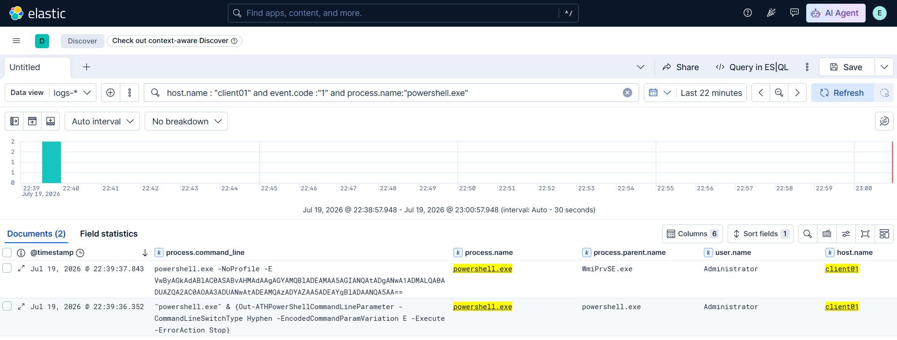
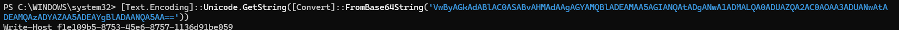

# Incident Report: T1059.001 PowerShell Encoded Command

| | |
|---|---|
| **Report ID** | IR-2026-001 |
| **Date of activity** | 2026-07-19 |
| **Analyst** | Karthik S |
| **Host** | CLIENT01 (`192.168.64.30`), Windows 11 Enterprise, domain `lab.local` |
| **Source** | Controlled test, Atomic Red Team T1059.001 (encoded-parameter variation tests) |
| **Severity** | Medium |
| **Status** | Detected, tuned, closed |

## 1. Summary

Two PowerShell processes were launched on **CLIENT01** using an **encoded command** switch (T1059.001), one invoked via **WMI** (`WmiPrvSE.exe` parent). Both were generated by an Atomic Red Team test exercising abbreviated forms of the `-EncodedCommand` flag. The encoded payload decoded to a benign GUID marker, confirming this as controlled test activity rather than a live intrusion.

## 2. ATT&CK mapping

- **Tactic:** Execution (TA0002)
- **Technique:** T1059.001, Command and Scripting Interpreter: PowerShell
- **Notable sub-behaviour:** encoded-command obfuscation via switch abbreviation; process spawned through WMI (relates to T1047 Windows Management Instrumentation).

## 3. Timeline (as seen in Kibana Discover, `logs-*`)

| Timestamp | Event | Detail |
|---|---|---|
| 2026-07-19 22:39:36.352 | Sysmon EID 1 (process create) | `powershell.exe` AtomicTestHarnesses invocation (`Out-ATHPowerShellCommandLineParameter -CommandLineSwitchType Hyphen -EncodedCommandParamVariation E -Execute`); parent `powershell.exe`; user `Administrator`. The `-EncodedCommandParamVariation E` names the single-letter alias under test. |
| 2026-07-19 22:39:37.843 | Sysmon EID 1 (process create) | `powershell.exe -NoProfile -E VwByAGkAdABlAC0…`, the actual encoded execution; **parent `WmiPrvSE.exe`**; user `Administrator`. |

**Decoded payload** (Base64 / UTF-16LE): `Write-Host f1e109b5-8753-45e6-8757-1136d91be059`, a benign marker written by the atomic to prove execution.

## 4. Detection

**Telemetry source:** Sysmon Event ID 1 (Process Creation), shipped by Elastic Agent via the `windows.sysmon_operational` data stream into Elastic (data view `logs-*`).

**Validated hunt query (KQL):**

```
host.name:"client01" and event.code:"1" and process.name:"powershell.exe"
and (process.command_line:*\-e* or process.parent.name:"WmiPrvSE.exe")
```

**Portfolio detection:** `detections/T1059.001-powershell-encoded-command.yml` (Sigma). The rule matches `powershell.exe` where the command line carries an encoded-command switch, captured with a regex covering every valid abbreviation of `-EncodedCommand` (`-e`, `-en`, `-enc`, `-ec`, up to `-EncodedCommand`, case-insensitive), OR where the parent process is `WmiPrvSE.exe`. Sigma `condition: selection_img and (selection_enc or selection_wmi_parent)`.

## 5. IOCs

> Lab/test artifacts from a controlled atomic, recorded for completeness. In a live incident the decoded payload would be the malicious content of interest.

- **Host:** CLIENT01 / `192.168.64.30`
- **Account:** `LAB\Administrator` (cached interactive logon; DC01 offline during test)
- **Process:** `powershell.exe` with flags `-NoProfile -E <base64>`
- **Parent process (notable):** `WmiPrvSE.exe`
- **Encoded payload (Base64):** `VwByAGkAdABlAC0ASABvAHMAdAAgAGYAMQBlADEAMAA5AGIANQAtADgANwA1ADMALQA0ADUAZQA2AC0AOAA3ADUANwAtADEAMQAzADYAZAA5ADEAYgBlADAANQA5AA==`
- **ART execution marker (benign):** GUID `f1e109b5-8753-45e6-8757-1136d91be059`

## 6. False-positive analysis

- **Encoded PowerShell is used legitimately** by some installers, management agents, and scheduled jobs that invoke `-EncodedCommand`. The flag alone is suspicious, not conclusive; triage by decoding the payload and checking the parent process and signer.
- **WMI-spawned PowerShell** (`WmiPrvSE.exe` parent) also occurs with legitimate remote-management tooling, so that clause can be noisier. It is retained as a resilience backstop and the rule is scoped to `medium`, not `high`.
- **Tuning applied:** the initial hunt filtered on the literal string `*Encode*` and **missed this event entirely**, because the real command line used the single-letter alias `-E`, which never contains "Encode". The detection was rewritten from a literal string match to an **alias-aware regex** on the encoded-command switch, plus the WMI-parent behavioural clause, so switch-abbreviation can no longer evade it. This gap-and-fix is the core finding of this report.

## 7. Containment & remediation

In a real incident with a non-benign decoded payload, an analyst would:

- **Isolate** CLIENT01 from the network pending investigation.
- **Reset credentials** for the executing account (`Administrator`) and review its recent logons.
- **Scope** the payload: decode it, hash any dropped or downloaded artifacts, look up reputation, and hunt the same encoded-command plus WMI-parent pattern across other endpoints.
- **Investigate the WMI vector**, since WMI-spawned PowerShell can indicate lateral movement or WMI-based persistence; review `WmiPrvSE.exe` activity and WMI subscriptions.
- **Preventive hardening:** enable PowerShell Script Block Logging (EID 4104) and Module Logging so future encoded commands are captured decoded at source, and constrain PowerShell (Constrained Language Mode / WDAC) where feasible.

## 8. Evidence

**Detected event in Kibana Discover** (broadened query `host.name:"client01" and event.code:"1" and process.name:"powershell.exe"`). The 22:39:37 child shows `powershell.exe -NoProfile -E <base64>` with parent `WmiPrvSE.exe`; the 22:39:36 harness row shows `-EncodedCommandParamVariation E`, the alias under test.



**Decoded payload** (Base64 / UTF-16LE), resolving to the benign ART execution marker:



---
*Detection authored in Sigma for portability.*
